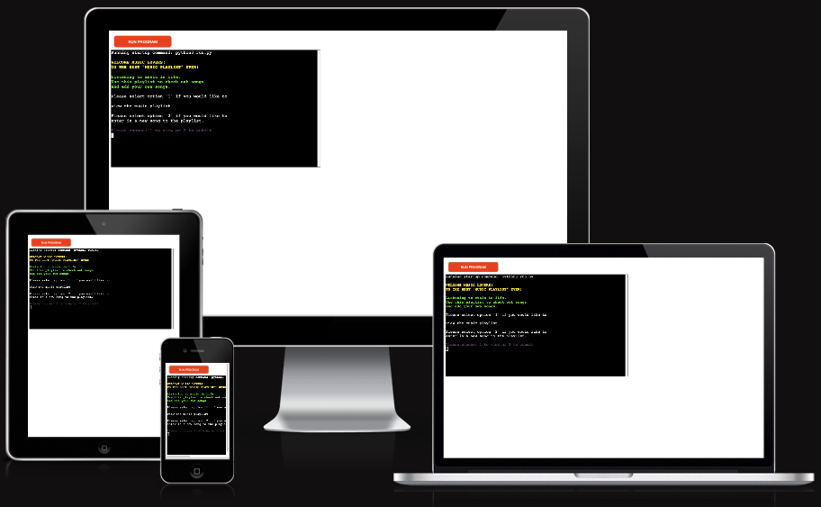
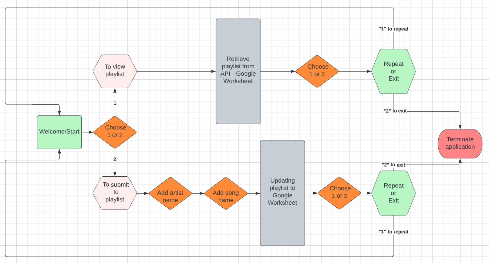
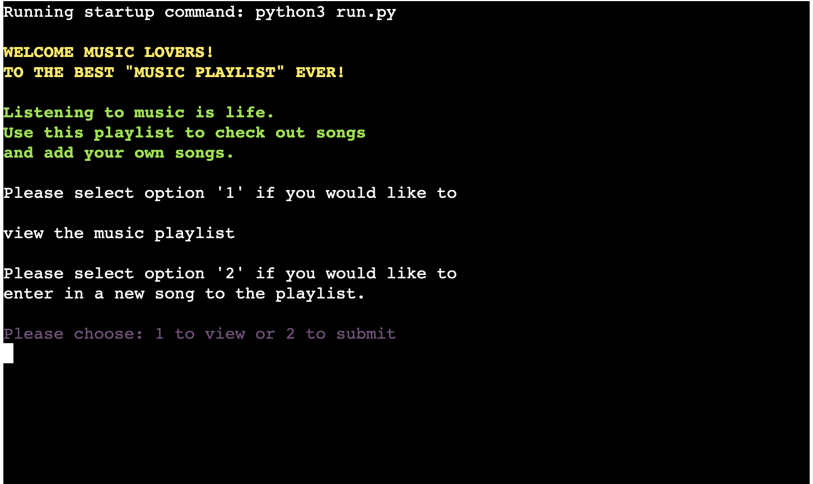
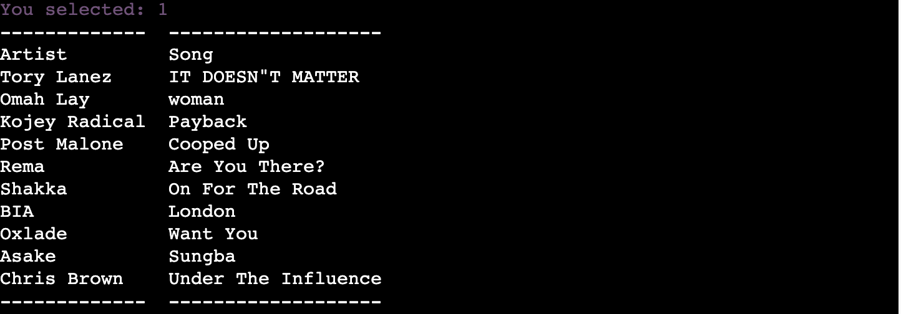
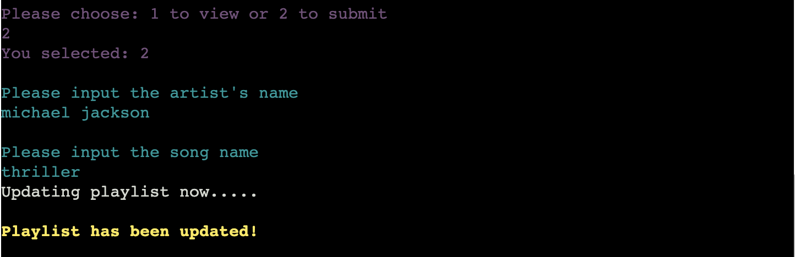
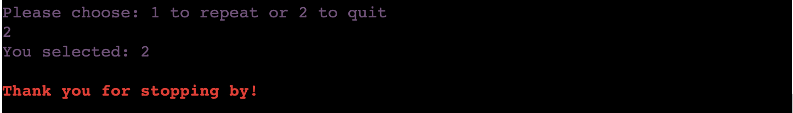
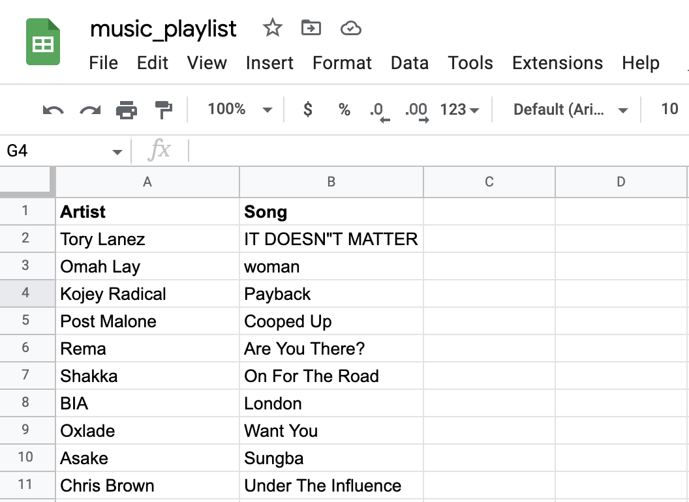
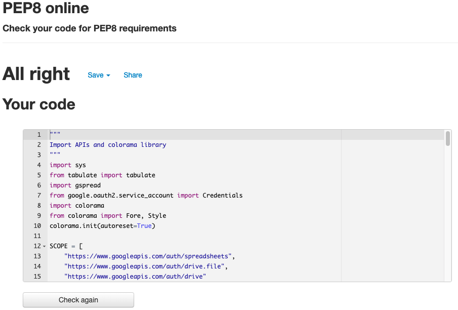

# Music Playlist

## Overview
A playlist is a list of songs or pieces of music. It's a word that started out in radio stations - the 'playlist' was all the tracks that were to be played that day on the show. A playlist can be unique to you with all your favourite songs and can be shared with friends where they can also share theirs and update the playlist.
Music Playlist has been created for users to view and add songs to the playlist everytime they access the app. This playlist consists pre-set songs already ready to be viewed and obtained. Through different routes the user takes, they can can view these songs to provide them new songs to share with friends or play at parties. Another route they can take is to also add songs to the playlist and keep increasing the number of songs in the playlist. At the end of each option, the user have the option to go back to the main menu and re-choose again or exit the program.

[Access Music Playlist Here!](https://p3-music-playlist.herokuapp.com/)

## Contents
- [User Experience (UX)](#User-Experience-UX)
   - [Aim](#Aim)
   - [Target Audience](#Target-Audience)
   - [User Stories](#User-Stories)
      - [First Time User](#First-Time-User)
      - [Revisiting User](#Revisiting-User)

- [Design](#Design)

- [Features](#Features)
   - [Existing Features](#Existing-Features)
      - [Welcome](#Welcome-Section)
      - [View Songs On Playlist](#View-Songs-On-Playlist-Section)
      - [Submit Songs To Playlist](#Submit-Songs-Section)
      - [Repeat Or Quit Application](#Repeat-Or-Quit-Application)
      - [Exit Message](#Exit-Message)
      - [Google Worksheet](#Google-Worksheet)
      - [Features Left To Implement](#Features-Left-To-Implement)

- [Technologies Used](#Technologies-Used)
   - [Languages Used](#Languages-Used)
   - [APIs And Libraries Used](#APIs-And-Libraries-Used)
   - [Frameworks, Libraries And Programs Used](#Frameworks-Libraries-And-Programs-Used)
      - [Lucid Chart](#Lucid-Chart)
      - [Git](#Git)   
      - [Gitpod](#Gitpod)
      - [Github](#Github)
      - [Gitpod Python Essentials Template](#Gitpod-Python-Essentials-Template)
      - [Heroku](#Heroku)

- [Testing](#Testing)
  - [Bugs Encountered And Solutions](#Bugs-Encountered-And-Solutions)
  - [Validator Testing](#Validator-Testing)
     - [PEP8 Online](#PEP8-Online)    
  - [Unfixed Bugs](#Unfixed-Bugs)

- [Deployment](#Deployment)

- [Credits](#Credits)
   - [Code](#Code)
   - [Content](#Content)
   - [Media](#Media)
   - [Acknowledgments](#Acknowledgments)

## User Experience (UX)

### Aim
The aim of this program is to provide users with new music and to have the option to add to the list of songs in the playlist.

### Target Audience
This was created for all musice lovers to listen to music and share music. It's for people who would like to discover new songs and add songs to it to share with other music lovers who would like to access the playlist too.
### User Stories

- #### First Time Users
  - As a first time user, I want to be able to have options to either view or add songs to the playlist.
  - As a first time user, I want to be able to view songs on the playlist.
  - As a first time user, I want to be able to go back to the main menu to revist the options.
  - As a first time user, I want to be able to add songs to the playlist.

- #### Revisiting Users
  - As a revisiting user, I want to be able view the updated songs on the playlist from the last time visited
  - As a revisiting user, I want to be able to add more songs to keep updating the playlist
  - As a revisiting user, I want to be able to exit the program after viewing or adding songs.

## Design

## Features
The features on this application was created to provide users with options to view songs or add songs to the playlist.

### Existing Features
#### Welcome
  - This is the introductory section that welcomes the user to the application. It provide them with information about the application and how to go about using it. It provides them the options to either view songs or add songs to the playlist.

#### View Songs On Playlist  
  - This is the section where user chooses to view the songs on the playlist. This section showcases all the songs on the playlist for users to copy.

#### Submit Songs To Playlist Section
  - This is the submit section that allows the users to submit songs via inputting the artist name and song name.
  - There's an option to add artist name they would like to submit to the playlist.
  - There's an option to add song name they would like to submit to the playlist.

##### Image 1: Submitting Songs To Playlist

##### Image 2: Updated Songs To Playlist

#### Repeat Or Quit Application
  - Once the user has either viewed or added songs to the playlist, they are prompted to either repeat or quit the program.
  - This gives the user the option to either start again from the main menu or to quit the program.

#### Exit Message
  - This is the exit message that comes up when user decides to quit the application.

#### Google Worksheet
  - A cloud based google worksheet used to access data for the application.

## Features Left To Implement
- To add a function that actually plays the songs on the playlist when viewing the playlist.
- To automatically update the playlist using a certified radio weekly chart so that new music are always added to it alongside with users submission.
- To add multiple playlist of different genres for the user to choose from and add to it.
- To add option to be able to delete songs from the playlist.

## Technologies Used

### Languages Used

 - [Python](https://en.wikipedia.org/wiki/Python_(programming_language))
 - [JavaScript](https://en.wikipedia.org/wiki/JavaScript) - This was provided in the Code Institute template
 - [CSS](https://en.wikipedia.org/wiki/CSS) - This was provided in the Code Institute template
 - [HTML5](https://en.wikipedia.org/wiki/HTML) - This was provided in the Code Institute template

### APIs and Libraries
 - [Google Drive](https://developers.google.com/drive/api)
 - [Google Worksheet](https://developers.google.com/sheets/api)
 - [Sys](https://docs.python.org/3/library/sys.html)
 - [Tabulate](https://pypi.org/project/tabulate/)
 - [Google Auth](https://google-auth.readthedocs.io/en/master/index.html)
 - [Gspread](https://docs.gspread.org/en/latest/)
 - [Colorama](https://pypi.org/project/colorama/)

 ### Frameworks, Libraries And Programs Used

1. #### [Lucid:](https://lucid.co/)
  - Lucid Chart was used to create the flow and the logic of the application before coding it.

2. #### [Git:](https://git-scm.com/)
  - Git was used in the Gitpod terminal to add, commit and push code to Github.

3. #### [Gitpod:](https://www.gitpod.io/)
  - Gitpod is the Integrated Developer Environment used to code this project.

4. #### [Github:](https://github.com/)
  - Github was used to hold and keep the pushed codes by Git and store projects.

5. #### [Gitpod Python Essentials Template:](https://github.com/Code-Institute-Org/python-essentials-template)
  - Gitpod Python Essentials Template was provided by code institute and it consisted of all the relevant tools needed to code this program.

6. #### [Heroku](https://id.heroku.com/login)
  - Heroku was used to deploy the project to which users can access.

## Testing

### Manual Testing
 - Application was consistently tested throughout each developmental stage of creating the application. Manual testing on application after deployment was conducted by the developer and fellow classmates Lauren-Nicole and Mats to which everything was running smoothly.

### Validator Testing
 - #### PEP8 Online
   - No errors were returned when passing through the official [PEP8 Online](http://pep8online.com/)

### Bugs Encountered And Solutions:
 - #### Bugs
   - Data wasn't pushing to the google worksheet when submitting the songs.

 - #### Solution
   - Had to change my code and re-do the google worksheet to allow data to be pushed to the worksheet.

### Unfixed Bugs
All bugs were fixed before the submission of this project.

## Deployment
The open source developer environment used to write and edit code was Gitpod. Git was used to add, commit and push code to Github. Github is the hosting used to store pushed codes by Git. Heroku was used to deploy the live version of the project.

- Below are the steps followed to deploy site to Heroku:
  - Log in or Sign up to [Heroku](https://id.heroku.com/login)
  - On dashboard, click "Create New App". 
  - On the "Create New App" page, name your app (needds to be a unique name), choose a region and click the "Create App" button.
  - On app page, find and delect the "Settings" tab at the top of the page. Scroll down and locate the "Convig Vars" on the settings page
  - Click "Reveal Config Vars" and a pop box with placeholder words KEY and VALUE in it.
  - In the KEY section insert "PORT" and in the VALUE section insert "8000".
  - For having credentials, creat another config vars with CREDS In the KEY section and paste the JSON into the VALUE section.
  - Next scroll down to add "Buildpacks". Click "Add buildpack". Select the "Python" as the first buildpack and save changes. 
  - Redo the above step and add another buildpack, select "nodejs" and save changes. The order of the buildpacks should be python on top and then followed by nodejs on the bottom.
  - Scroll back up and locate the "Deploy" tab and select to access its page.
  - Once on the "Deploy" page, find "Deployment method" section, select "Github" and click the "Connect to Github" button.
  - On "Connect to Github" section, search for your Github repository name you want to deploy by using the empty imput field provided and click "Search" to search for the repository name.
  - After clicking "Search", repository name should appear and then click "Connect" button beside it. Now everytime you push to Github, you will be able to deploy on Heroku.
  - Scroll down, to "Automatic deploys" and "Manual deploy" section. You can deploy via these tow options.
  - You can set up "Automatic deploys" by clicking on "Enable Automatic Deploys"
  - To deploy manually, click the "Deploy Branch" button. 
  - Finally, you'll see "Your app was successfully deployed" pop up message with a "View" button to access the deployed application. 

## Credits
### Code
- [Grepper](https://www.codegrepper.com/index.php)
  - Used to help write expressions.
- [Google Sheets for Developers](https://developers.google.com/sheets/api/reference/rest/v4/spreadsheets/cells)
  - Used to help with pushing and pulling data from Google Sheet.
- [GeeksforGeeks](https://www.geeksforgeeks.org/)
  - Used for the system exit code for the application.

### Content
- Contents on this application were written by the developer.
- Love Sandwiches walkthrough video was used to deploy the application on Heroku.
- [Jie Jenn](https://www.youtube.com/watch?v=txfiwEjb7sk)
  - Used to understand Google Sheets API in Python.
- [Code Institue](https://codeinstitute.net/) Love Sandwiches walkthrough video was used to understand how to deploy project to Heroku.

### Media
- All the songs on the music playlist was taken from my personal playlist.

### Acknowledgments
- #### Mentor
  - Thanks to my Mentor for providing me with ideas for project.
  - Thanks to my mentor for the continous feedback during our meetings.
  - Thanks to my Mentor for providing me with new functionalitites to work with.

- #### Tutor Support Team
  - Thanks to Sean for helping me to sort out the bug that stopped the inputs to be pushed to my worksheet.
  - Thanks to John for helping retrieve my README.md file after I accidentally deleted it.

- #### Fellow classmates/aluminis on Slack
  - Thanks to my fellow classmate Lauren-Nicole for helping bounce ideas around and to help me write the code.
  - Thanks to Mat for helping me understanding the basic structures to code on Python.
  - Thanks to Ger for teaching me how to write some of the code that wasn't working for me.
  - Thanks to Frankie for the ample amount of resources to help aid me with my project.
