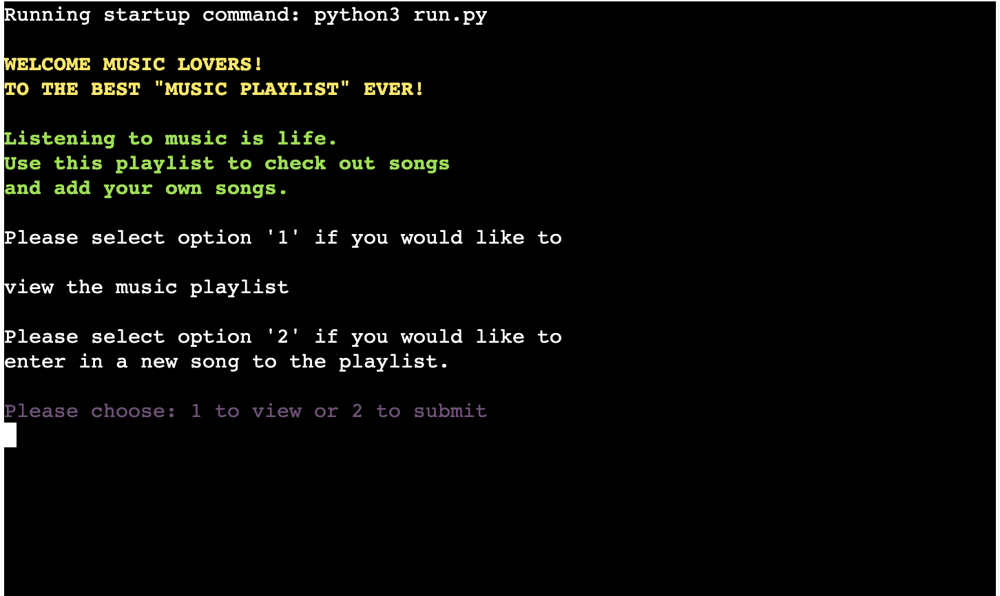
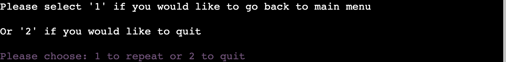

# Music Playlist

## Overview
A playlist is a list of songs or pieces of music. It's a word that started out in radio stations - the 'playlist' was all the tracks that were to be played that day on the show. A playlist can be unique to you with all your favourite songs and can be shared with people.
Music Playlist has been created for users to view and add songs to the playlist everytime they access the app. This playlist consists of songs already ready to be viewed. The users will have an option to view any new songs added to the playlist. Another route they can take is to add songs to the playlist and make it an ever-growing list of songs. 

[Access Music Playlist Here!](https://p3-music-playlist.herokuapp.com/)

## Contents
- [User Experience (UX)](#User-Experience-(UX))
   - [Aim](#Aim)
   - [Target Audience](#Target-Audience)
   - [User Stories](#User-Stories)
      - [First Time Users](#First-Time-Users)
      - [Revisiting Users](#Revisiting-Users)

- [Design](#Design)

- [Features](#Features)
   - [Existing Features](#Existing-Features)
      - [Welcome](#Welcome)
      - [View Songs On Playlist](#View-Songs-On-Playlist)
      - [Submit Songs To Playlist](#Submit-Songs)
      - [Repeat Or Quit Application](#Repeat-Or-Quit-Application)
      - [Exit Message](#Exit-Message)
      - [Google Worksheet](#Google-Worksheet)
      - [Features Left To Implement](#Features-Left-To-Implement)

- [Technologies Used](#Technologies-Used)
   - [Languages Used](#Languages-Used)
   - [APIs And Libraries Used](#APIs-And-Libraries-Used)
   - [Frameworks, Libraries And Programs Used](#Frameworks-Libraries-And-Programs-Used)
      - [Lucid Chart](#Lucid-Chart)
      - [Git](#Git)   
      - [Gitpod](#Gitpod)
      - [Github](#Github)
      - [Gitpod Python Essentials Template](#Gitpod-Python-Essentials-Template)
      - [Heroku](#Heroku)

- [Testing](#Testing)
  - [Bugs Encountered And Solutions](#Bugs-Encountered-And-Solutions)
  - [Validator Testing](#Validator-Testing)
     - [PEP8 Online](#PEP8-Online)    
  - [Unfixed Bugs](#Unfixed-Bugs)

- [Deployment](#Deployment)

- [Credits](#Credits)
   - [Code](#Code)
   - [Content](#Content)
   - [Media](#Media)
   - [Acknowledgments](#Acknowledgments)

## User Experience (UX)

### Aim
The aim of this application is to provide users with a list of songs and to have the option to add to their own songs to the playlist.

### Target Audience
This was created for all music lovers who would like to discover new songs and contribute in sharing their favourite songs to the playlist for others to access and discover it.
### User Stories

- #### First Time Users
  - As a first time user, I want to be able to view songs on the playlist.
  - As a first time user, I want to be able to add songs on the playlist.
  - As a first time user, I want to be able to go back to the main menu to revist the options.

- #### Revisiting Users
  - As a revisiting user, I want to be able view the updated songs on the playlist from the last time visited.
  - As a revisiting user, I want to be able to add more songs to the playlist.
  - As a revisiting user, I want to be able to exit the program after viewing or adding songs.

## Design

## Features
The features on this application was created to provide users with options to view songs or add songs to the playlist.

### Existing Features

#### Welcome
  - This is the introductory section that welcomes the user to the application. It provides information about the application and how to go about using it. 
  - Users will have the option to either view songs or add songs to the playlist.

#### View Songs On Playlist  
  - After user chooses to view songs, a tabulated list of songs will appear for users to view. 

#### Submit Songs To Playlist
  - After user chooses to submit songs, they will then need to add additonal informatio to add song. 
  - User will need to input the artist name they would like to submit.
  - After inputting artist name, user will need to input the song name in order to submit the song to the playlist.
  - The user can go back to the main menu and view the song they've added to the playlist.

##### Image 1: Submitting Songs To Playlist

##### Image 2: Updated Songs To Playlist

#### Repeat Or Quit Application
  - User are given the option to repeat or quit application after viewing or adding songs.
  - This gives the user the option to either start again from the main menu or to quit the application.

#### Exit Message
  - Exit message that comes up when user decides to quit the application.

#### Google Worksheet
  - A cloud based google worksheet was used to retrieve and submit data.

## Features Left To Implement

- To add a function that actually plays the songs on the playlist when viewing the playlist.
- To add multiple playlist of different genres for the user to choose from and add to it.

## Technologies Used

### Languages Used

 - [Python](https://en.wikipedia.org/wiki/Python_(programming_language))
 - [JavaScript](https://en.wikipedia.org/wiki/JavaScript) - This was provided in the Code Institute template.
 - [CSS](https://en.wikipedia.org/wiki/CSS) - This was provided in the Code Institute template.
 - [HTML5](https://en.wikipedia.org/wiki/HTML) - This was provided in the Code Institute template.

### APIs and Libraries Used

 - [Google Drive](https://developers.google.com/drive/api)
 - [Google Worksheet](https://developers.google.com/sheets/api)
 - [Sys](https://docs.python.org/3/library/sys.html)
 - [Tabulate](https://pypi.org/project/tabulate/)
 - [Google Auth](https://google-auth.readthedocs.io/en/master/index.html)
 - [Gspread](https://docs.gspread.org/en/latest/)
 - [Colorama](https://pypi.org/project/colorama/)

 ### Frameworks, Libraries And Programs Used

1. #### [Lucid Chart:](https://lucid.co/)
  - Lucid Chart was used to create the flow and the logic of the application before coding it.

2. #### [Git:](https://git-scm.com/)
  - Git was used in the Gitpod terminal to add, commit and push code to Github.

3. #### [Gitpod:](https://www.gitpod.io/)
  - Gitpod is the Integrated Developer Environment used to code this project.

4. #### [Github:](https://github.com/)
  - Github was used to hold and keep the pushed codes by Git and store projects.

5. #### [Gitpod Python Essentials Template:](https://github.com/Code-Institute-Org/python-essentials-template)
  - Gitpod Python Essentials Template was provided by code institute and it consisted of all the relevant tools needed for the successful running of the application.

6. #### [Heroku](https://id.heroku.com/login)
  - Heroku was used to deploy the project.

## Testing

### Manual Testing
 - This application was consistently tested throughout each developmental stage. Manual testing on application after deployment was conducted by the developer and fellow classmates Lauren-Nicole and Mats to ensure the application is running smoothly.

### Validator Testing
 - #### PEP8 Online
   - No errors were returned when passing through the official [PEP8 Online](http://pep8online.com/)

### Bugs Encountered And Solutions:
 - #### Bugs
   - Add issues pushing data to the google worksheet when submitting songs in application.

 - #### Solution
   - Had to change my code and re-do the google worksheet to allow data to be pushed to the worksheet.

### Unfixed Bugs
All bugs were fixed before the submission of this project.

## Deployment
The open source developer environment used to write and edit code was Gitpod. Git was used to add, commit and push code to Github. Github is the hosting used to store pushed codes by Git. Heroku was used to deploy the live version of the project.

- Below are the steps followed to deploy site to Heroku:
  - Log in or Sign up to [Heroku.](https://id.heroku.com/login)
  - On dashboard, click "Create New App" or click the "New" dropdown menu on the top right of the page to access "Create New App"
  - On the "Create New App" page, name your app (needs to be a unique name), choose a region and click the "Create App" button.
  - On app page, find and select the "Settings" tab at the top of the page. Scroll down and locate the "Convig Vars" on the settings page.
  - Click "Reveal Config Vars".
  - In the "KEY" section insert "PORT" and in the "VALUE" section insert "8000".
  - For having credentials, create another "Config Vars" with "CREDS" in the "KEY" section and paste the "JSON" information into the "VALUE" section.
  - Next scroll down to add "Buildpacks". Click "Add buildpack". Select the "Python" as the first buildpack and save changes. 
  - Redo the above step and add another buildpack, select "nodejs" and save changes. The order of the buildpacks should be python on top and then followed by nodejs underneath.
  - Scroll back up and locate the "Deploy" tab and select to access the page.
  - Once on the "Deploy" page, find "Deployment method" section, select "Github" and click the "Connect to Github" button.
  - On "Connect to Github" section, search for your Github repository name you want to deploy by using the empty imput field provided and click "Search" to search for the repository name.
  - After clicking "Search", repository name should appear and then click "Connect" button beside it. Now everytime you push to Github, you will be able to deploy on Heroku.
  - Scroll down, to "Automatic deploys" and "Manual deploy" section. You can deploy via these two options.
  - You can set up "Automatic deploys" by clicking on "Enable Automatic Deploys"
  - To deploy manually, click the "Deploy Branch" button. 
  - Finally, you'll see "Your app was successfully deployed" pop up message with a "View" button to access the deployed application. 

Find My Deployed Application [Here!](https://p3-music-playlist.herokuapp.com/)

## Credits

### Code
- [Grepper](https://www.codegrepper.com/index.php)
  - Used to help write expressions.
- [Google Sheets for Developers](https://developers.google.com/sheets/api/reference/rest/v4/spreadsheets/cells)
  - Used to help with pushing and pulling data from Google Sheet.
- [GeeksforGeeks](https://www.geeksforgeeks.org/)
  - Used for the system exit code for the application.

### Content
- Contents on this application were written by the developer.
- Love Sandwiches walkthrough video was used to deploy the application on Heroku.
- [Jie Jenn](https://www.youtube.com/watch?v=txfiwEjb7sk)
  - Used to understand Google Sheets API in Python.
- [Code Institue](https://codeinstitute.net/) Love Sandwiches walkthrough video was used to understand how to deploy project to Heroku.

### Media
- All the songs on the music playlist was taken from my personal playlist.

### Acknowledgments
- #### Mentor
  - Thanks to my Mentor for providing me with ideas for project.
  - Thanks to my mentor for the continous feedback during our meetings.

- #### Tutor Support Team
  - Thanks to Sean for helping me to sort out the bug that stopped the inputs to be pushed to my worksheet.
  - Thanks to John for helping retrieve my README.md file after it accidentally got deleted.

- #### Fellow classmates/aluminis on Slack
  - Thanks to my fellow classmate Lauren-Nicole for the moral support and helping to understand how to write the submit code.
  - Thanks to Mat for helping me understanding the basic structures to code on Python.
  - Thanks to Ger for teaching me how to write some of the code that wasn't working for me.
  - Thanks to Frankie for providing me with ample amount of resources to help me with my project.
